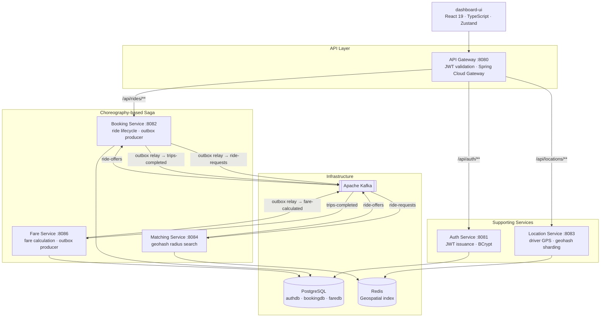

# Ride-Hailing Platform

A production-grade ride-hailing backend built as **event-driven microservices** on Java 21 and Apache Kafka. The system implements a **choreography-based saga** for the booking-to-fare lifecycle, the **transactional outbox pattern** for guaranteed event delivery, and **Redis geohash sharding** for real-time driver proximity search.


---

## Architecture



---

## How a ride flows

| Step | What happens |
|------|-------------|
| **1. Book** | Passenger calls `POST /api/rides/v1/bookings`. `BookingService` writes a `Booking` (PENDING) **and** an `OutboxMessage` in a single transaction. |
| **2. Relay** | `OutboxRelayWorker` polls every 2 s, publishes unprocessed rows to `ride-requests`, keyed by `bookingId` for partition ordering. Halts on Kafka failure to preserve sequence. |
| **3. Match** | `RideRequestConsumer` receives the event. `MatchingService` queries Redis across 9 geohash cells (rider's cell + 8 neighbours, 3 km radius) and selects the nearest available driver, skipping any previously rejected drivers. Publishes to `ride-offers`. |
| **4. Confirm** | `RideOfferedEventConsumer` in booking-service receives `ride-offers` and updates the booking with the assigned driver and new status. |
| **5. Complete** | `BookingService.endBooking()` writes a `trips-completed` outbox message, relayed to Kafka. |
| **6. Fare** | `TripCompletedConsumer` in fare-service checks for an existing fare first (idempotency guard), then calculates: `$2.50 base + $1.25/km + $0.15/min`. Result is persisted and published to `fare-calculated` via the outbox. |

---

## Key engineering decisions

### Transactional outbox pattern
The booking and fare writes to PostgreSQL and their corresponding Kafka publishes are **never in the same transaction**. Each service writes an `outbox_messages` row alongside the business entity in one atomic DB transaction. A dedicated `OutboxRelayWorker` polls for unprocessed rows and forwards them to Kafka, eliminating the dual-write problem entirely. A crash between steps loses nothing — the relay picks up on restart.

### Choreography-based saga
There is no central orchestrator. Each service reacts to events and emits the next one:

```
Booking ──(ride-requests)──▶ Matching ──(ride-offers)──▶ Booking ──(trips-completed)──▶ Fare
```

Services are fully decoupled and independently deployable. Adding a new participant (e.g. a notifications service) requires zero changes to existing services.

### Driver rejection and retry
The `RideRequestedEvent` carries a `rejectedDrivers` list. When a driver declines a ride, the booking service re-publishes the event with that driver appended to the list. `MatchingService` skips rejected drivers and assigns the next nearest — no saga rollback needed.

### Redis geohash sharding
Driver locations are stored sharded by 5-character geohash (`driver_locations:{geohash}`, ~4.9 km cells). A proximity query covers 9 cells (target + 8 neighbours) to eliminate boundary misses, merges results client-side, and returns drivers sorted by distance. This avoids a hot single-key bottleneck under high write load from thousands of concurrent drivers.

### JWT boundary at the gateway
`api-gateway` validates the JWT, strips the `Authorization` header, and injects `X-User-Id` and `X-User-Role` headers. Downstream services trust these headers — no JWT library dependency, no secret distribution beyond two services.

### Java 21 virtual threads
`location-service` and `matching-service` run on virtual threads (`spring.threads.virtual.enabled=true`), allowing high-concurrency I/O (Redis GEOSEARCH across 9 shards) without a large thread pool.

---

## Services

| Service | Port | Stack | Responsibility |
|---------|------|-------|---------------|
| api-gateway | 8080 | Spring Cloud Gateway | JWT validation, request routing |
| auth-service | 8081 | Spring Security, JJWT, PostgreSQL | Register, login, JWT issuance |
| booking-service | 8082 | Spring Kafka, Spring JPA, PostgreSQL | Ride lifecycle, outbox producer |
| location-service | 8083 | Spring Data Redis, geohash-java | Driver GPS updates, geo queries |
| matching-service | 8084 | Spring Kafka, Spring Data Redis | Nearest-driver match, rejection handling |
| fare-service | 8086 | Spring Kafka, Spring JPA, PostgreSQL | Fare calculation, idempotent processing |
| dashboard-ui | 5173 | React 19, Vite, TypeScript, Zustand | Passenger and driver web client |

## Kafka topics

| Topic | Producer | Consumer |
|-------|----------|----------|
| `ride-requests` | booking-service | matching-service |
| `ride-offers` | matching-service | booking-service |
| `trips-completed` | booking-service | fare-service |
| `fare-calculated` | fare-service | *(analytics / notifications — extensible)* |

---

## Running locally

**Full stack (recommended):**
```bash
docker-compose up --build
```
Kafka UI → http://localhost:9000

**Infrastructure only + services on bare JVM** (requires Java 21):
```bash
docker-compose up postgres redis zookeeper kafka

# Then in separate terminals, from each service directory:
./mvnw spring-boot:run
```

**Frontend:**
```bash
cd dashboard-ui
npm install
npm run dev     # http://localhost:5173
```

### Environment variables

| Variable | Services | Default |
|----------|----------|---------|
| `DB_URL` | auth-service, booking-service | `jdbc:postgresql://localhost:5432/{db}` |
| `DB_USER` / `DB_PASSWORD` | auth-service, booking-service | `postgres` / `postgres` |
| `JWT_SECRET` | api-gateway, auth-service | base64 key — must be identical in both |
| `REDIS_HOST` / `REDIS_PORT` | location-, matching-, fare-service | `localhost` / `6379` |

Docker-compose sets all of these automatically.

---

## Tech stack

| Layer | Technology |
|-------|-----------|
| Language | Java 21 (virtual threads), TypeScript |
| Frameworks | Spring Boot 3.5, Spring Cloud Gateway, Spring Security |
| Messaging | Apache Kafka (Confluent 7.3) |
| Databases | PostgreSQL 16, Redis 7 |
| Geospatial | Redis GEOSEARCH, geohash-java (5-char precision) |
| Auth | JJWT 0.12.6, BCrypt |
| Frontend | React 19, Vite, Zustand, Axios |
| Containers | Docker, Docker Compose |
